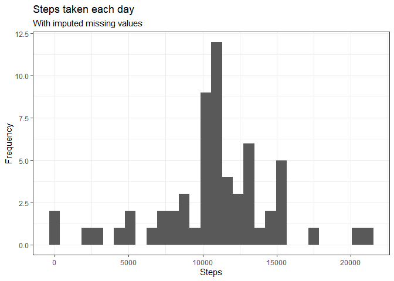

## Loading and preprocessing the data

First, I load the required packages:


```r
library(tidyverse)
```

```
## 
```

```
## v ggplot2 3.2.1     v purrr   0.3.3
## v tibble  2.1.3     v dplyr   0.8.3
## v tidyr   1.0.2     v stringr 1.4.0
## v readr   1.3.1     v forcats 0.4.0
```

```
## 
## x dplyr::filter() masks stats::filter()
## x dplyr::lag()    masks stats::lag()
```

Now, I read the data:


```r
data <- read_csv(unz("activity.zip", file.path("activity.csv")))
```

```
## Parsed with column specification:
## cols(
##   steps = col_double(),
##   date = col_date(format = ""),
##   interval = col_double()
## )
```

Let's see the structure of the data set using the `str` function:

```r
str(data)
```

```
## Classes 'spec_tbl_df', 'tbl_df', 'tbl' and 'data.frame':	17568 obs. of  3 variables:
##  $ steps   : num  NA NA NA NA NA NA NA NA NA NA ...
##  $ date    : Date, format: "2012-10-01" "2012-10-01" ...
##  $ interval: num  0 5 10 15 20 25 30 35 40 45 ...
##  - attr(*, "spec")=
##   .. cols(
##   ..   steps = col_double(),
##   ..   date = col_date(format = ""),
##   ..   interval = col_double()
##   .. )
```

We see that we have 17568 obs. and 3 variables.  
The variables `steps` and `interval` are numeric, and `date` is, not surprinsingly, a date.  
We also see that the first values of `steps` are missing. This variable has 2304 (around 13%) missing values.


## What is mean total number of steps taken per day?

First, I'll make a dataset containing the total number of steps taken per day. The assignment allows me to ignore the missing values to answer this question, so that's what I'll do.


```r
steps_day <- data %>%
      group_by(date) %>%
      summarise(sum_steps = sum(steps, na.rm = TRUE))
```

Now, I'll use the `ggplot2` package (which was loaded with `library(tidyverse)` to make a histogram of the total number of steps taken each day.


```r
ggplot(steps_day, aes(x = sum_steps)) +
      geom_histogram() +
      labs(title = "Steps taken each day",
           x = "Steps",
           y = "Frequency") +
      geom_vline(aes(xintercept = mean(sum_steps), col = "mean"), size = 1.5) +
      geom_vline(aes(xintercept = median(sum_steps), col = "median"), size = 1.5) +
      scale_color_manual(
        name = "Statistics", 
        values = c(median = "blue", mean = "red")) +
      theme_bw()
```

```
## `stat_bin()` using `bins = 30`. Pick better value with `binwidth`.
```

<!-- -->


```r
#Remove scientific notation
options(scipen=999)

summary_steps <- steps_day %>%
      summarise(mean = mean(sum_steps),
                median = median(sum_steps))
```

The mean total number of steps taken per day is equal to 9354.23.  
The median total number of steps taken per day is equal to 10395.

## What is the average daily activity pattern?

The task here is to make a time series plot of the 5-minute interval (x-axis) and the average number of steps taken, averaged across all days (y-axis).  


```r
#avg_dap: average daily activity pattern
avg_dap = data %>%
      group_by(interval) %>%
      summarise(avg = mean(steps, na.rm = TRUE)) 
      
ggplot(avg_dap, aes(x = interval, y = avg)) +
      geom_line() +
      labs(title = "Average daily activity pattern",
           x = "5-minute interval",
           y = "Average number of steps")
```

<!-- -->

On average across all the days in the dataset, the 835 - 840 interval, contains the maximum number of steps.

## Imputing missing values

There are a number of days/intervals where there are missing values (coded as `NA`). The presence of missing days may introduce bias into some calculations of summaries of the data.

This value was calculated before, when exploring the structure of the dataset. As a remainder, the `steps` variable has 2304 (around 13%) missing values.

I'll fill the missing values in the dataset with the mean for the 5-minute interval corresponding to that missing value.


```r
# First, I create a dataset with the mean of each 5-minute interval (removing NAs)
int_means <- data %>%
      group_by(interval) %>%
      summarise(mean = mean(steps, na.rm = TRUE))

# Now, I create the new dataset
imputed <- data %>%
      left_join(int_means, by = "interval") %>%
      mutate(steps2 = ifelse(is.na(steps), mean, steps))
```


```r
steps_day_imputed <- imputed %>%
      group_by(date) %>%
      summarise(sum_steps = sum(steps2))

ggplot(steps_day_imputed, aes(x = sum_steps)) +
      geom_histogram() +
      labs(title = "Steps taken each day ",
           subtitle = "With imputed missing values",
           x = "Steps",
           y = "Frequency") +
      theme_bw()
```

```
## `stat_bin()` using `bins = 30`. Pick better value with `binwidth`.
```

<!-- -->

```r
#Remove scientific notation
options(scipen=999)

summary_steps_imputed <- steps_day_imputed %>%
      summarise(mean = mean(sum_steps),
                median = median(sum_steps))
```

After imputing the missing values:

- The mean total number of steps taken per day is equal to 10766.19.  
- The median total number of steps taken per day is equal to 10766.19.

So, the values differ from the estimates from the first part of the assignment (mean was 9354.23, median was 10395). 

Both the mean and the median increased, we see that the mean increased more than the median did.

## Are there differences in activity patterns between weekdays and weekends?

First, I'll create a factor variable in the imputed dataset with two levels -"weekday" and "weekend" indicating wether a given date is a weekday or weekend day.


```r
imputed <- mutate(imputed,
                  day_type = case_when(
                        weekdays(date) %in% c("Saturday", "Sunday") ~ "weekend",
                        TRUE ~ "weekday"
                  ))
```

Now I can make a panel plot containing a time series plot of the 5-minute interval (x-axis) and the average number of steps taken, averaged across all weekday days or weekend days (y-axis).


```r
#avg_dap: average daily activity pattern
avg_dap_imputed = imputed %>%
      group_by(interval, day_type) %>%
      summarise(avg = mean(steps2)) 
      
ggplot(avg_dap_imputed, aes(x = interval, y = avg)) +
      geom_line() +
      labs(title = "Average daily activity pattern",
           subtitle = "With imputed missing values",
           x = "5-minute interval",
           y = "Average number of steps")+
      facet_grid(day_type~.)+
      theme_bw()
```

<!-- -->

We see that in weekdays, people tend to make more steps before 10 AM, while the numbers of steps taken after 10 AM is usually higher in weekends. I think this makes sense, because people usually goes to work in weekdays (they wake up and move to the workplace in the morning) and then stay working (not making so many steps while in the workplace). On the other hand, in weekends, people tend to sleep more, and do stuff in the afternoon (which results in making more steps).

